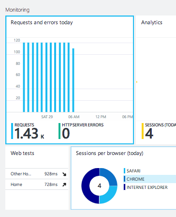
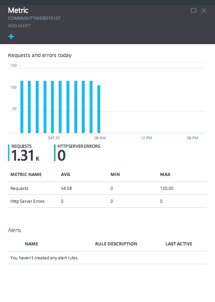
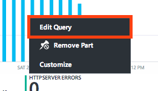
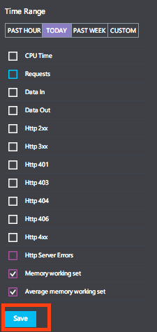
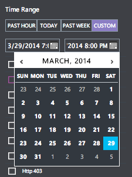
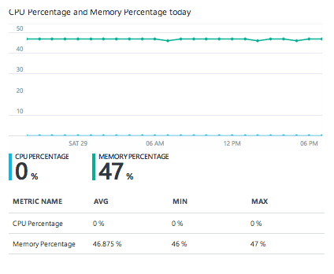
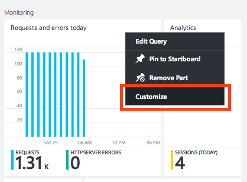
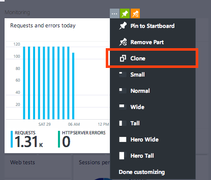
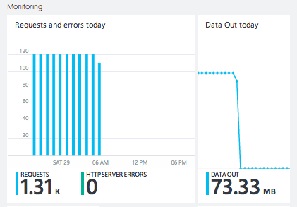

<properties title="How to customize monitoring" pageTitle="How to customize monitoring" description="Learn how to customize monitoring charts in Azure." authors="stepsic"  />

<tags ms.service="application-insights" ms.workload="tbd" ms.tgt_pltfrm="ibiza" ms.devlang="na" ms.topic="article" ms.date="01/01/1900" ms.author="stepsic" />

# Customizing monitoring

In the Azure Portal Preview, you can now view your monitoring data in more ways than you could before, including customizing the time range and choosing more metrics.

1. In the [Azure Portal Preview](https://portal.azure.com/), click **Browse**, then **Websites**, and then click the name of a Website to open the blade.

2. On then **Monitoring** lens you can Requests, Errors, [Web tests](http://go.microsoft.com/fwlink/?LinkID=394528&clcid=0x409), and [Analytics](http://go.microsoft.com/fwlink/?LinkID=394529&clcid=0x409). Clicking on the **Requests and errors today** part will show you the **Metric** blade.

   

3. The **Metric** blade shows you details about metrics that you select. At the top of the blade is a graph, below that a table that shows you aggregation of those metrics, such as average, minimum and maximum. Below that is a list of the alerts you’ve defined, filtered to the metrics that appear on the blade. This way, if you have a lot of alerts, you’ll only see the relevant ones here. You can still see all of the alerts for your website by clicking on the **Alert rules** part on the **Website** blade.

   

4. To customize the metrics that appear, right click on the chart and select **Edit Query**: 

   

5. On the Edit Query blade you can do two things: change the time range and chose different metics.

   

6. Changing the time range is as easy as selecting a different range (such as **Past Hour**) and clicking **Save** at the bottom of the blade. New in the Portal Preview, you can choose **Custom**:

  
   
7. Custom allows you to choose any period of time over the past 2 weeks, for example, you can see the whole two weeks, or, just 1 hour from yesterday. Type in the text box to enter a different hour.

8. Below the time range, you chan choose any number of metrics to show on the chart. You can see some new Metrics: **Memory working set** and **Average memory working set**.

9. When you click Save your changes will persist until you leave the Website blade. When you come back later, you'll see the original metric and time range again.

## Web hosting plan monitoring

Also new in the Azure Portal Preview is the ability to monitor performance metrics about the instances that your websites run on. To access these metrics, click on the Web Hosting Plan icon in the Summary lens.

   
   
There you can see a chart in the **Monitoring** lens that behaves just like the chart in the Website blade, except you can see the new metrics:
- CPU Percentage
- Memory Percentage
- HTTP Queue Depth
- Disk Queue Depth

## Creating side-by-side charts

With the powerful user customization in the Azure Portal Preview you can create side-by-side charts for customization.

1. First, right click on the chart you want to start from and select **Customize**

   

2. Then click **Clone** on the **...** menu to copy the part

   

3. Finally, click **Done** on the toolbar at the top of the screen. You can now treat this part like a normal metric part. If you right click and change the metric that is displayed, you can see two different metrics side-by-side at the same time:

   
   
Note, that the chart time range and chosen metrics will reset when you leave the portal.

